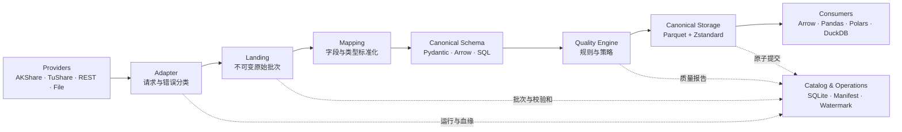

# OpenFinancialData

<div align="center">

**Any provider. One financial data standard.**

一个 Schema-first、provider-agnostic、local-first 的开源金融数据中台。

[](https://www.python.org/downloads/)
[](https://github.com/lilechen/open-financial-data)
[](https://github.com/lilechen/open-financial-data/tree/codex/main/tests)
[](https://www.apache.org/licenses/LICENSE-2.0)

[快速开始](#快速开始) · [核心能力](#核心能力) · [架构](#架构) · [数据产品](#数据产品) · [设计文档](docs/open-financial-data-design.md)

</div>

---

不同数据供应商会把同一种金融数据叫成不同名字、返回不同类型，并采用不同的更新方式。OpenFinancialData（OFD）把 AKShare、TuShare、REST API 和本地文件映射为稳定的标准 Dataset，让上层研究代码不再依赖某一家 Provider 的字段和接口。

```text
AKShare: 收盘      ┐
TuShare: close     ├──▶  close: float64  ──▶  Parquet / Arrow / Pandas / Polars / SQL
REST: close_price  ┘
```

OFD 只整理、验证和管理原始金融数据，不计算因子、不运行策略，也不做回测或撮合。

> [!IMPORTANT]
> 当前版本为 `0.1.0`（pre-alpha），仅支持 Python 3.13，尚未发布到 PyPI。Provider 的数据授权、频率限制和可用性由相应供应商决定。

## 为什么使用 OFD

- **统一 Schema**：一份存储中立定义可生成 Pydantic、Apache Arrow 和 SQL 类型。
- **随时切换 Provider**：按 Dataset、市场、资产类别、频率和复权方式配置数据源路由。
- **从空目录开始**：一个命令初始化项目并拉取指定日期范围的数据。
- **可靠增量更新**：Watermark、Manifest、任务持久化、重试、恢复与原子发布共同保证数据一致性。
- **质量规则解耦**：Schema 描述数据事实，Quality Policy 决定严重级别，独立引擎执行检查。
- **本地优先**：Parquet + SQLite，无需启动数据库或常驻服务。
- **全程可观察**：结构化日志、只追加审计、指标、运行状态、TUI 和资源占用均可查询。
- **可插件化**：Adapter、Mapping、Schema、Storage 都支持 Python entry point 扩展。

## 快速开始

### 1. 安装

```bash
git clone https://github.com/lilechen/open-financial-data.git
cd open-financial-data

python3.13 -m venv .venv
source .venv/bin/activate
pip install -e '.[akshare,duckdb,polars]'
```

开发环境：

```bash
pip install -e '.[dev,akshare,duckdb,polars]'
```

### 2. 一键建立数据目录

下面的例子只拉取平安银行一天的数据，适合验证环境：

```bash
ofd quickstart ./cn-market \
  --start 2024-01-02 \
  --end 2024-01-02 \
  --assets CN.XSHE.000001
```

正式拉取前可以先查看执行计划：

```bash
ofd quickstart ./cn-market \
  --start 2024-01-01 \
  --end 2024-12-31 \
  --dry-run
```

### 3. 检查并更新

```bash
ofd status --project ./cn-market
ofd doctor --project ./cn-market --provider akshare
ofd update --project ./cn-market
ofd validate --project ./cn-market \
  --dataset market.equity.bar \
  --profile equity-daily-standard
```

### 4. 在 Python 中读取

```python
from datetime import date

from open_financial_data.query import LocalDataClient

client = LocalDataClient.open("./cn-market")

table = client.read(
    dataset="market.equity.bar",
    asset_ids=("CN.XSHE.000001",),
    start=date(2024, 1, 1),
    end=date(2024, 12, 31),
    columns=("asset_id", "trade_date", "open", "high", "low", "close", "volume"),
)

print(table.to_pandas().tail())
```

也可以直接使用 DuckDB SQL：

```python
result = client.sql("""
    SELECT asset_id, trade_date, close
    FROM equity_daily
    WHERE asset_id = 'CN.XSHE.000001'
    ORDER BY trade_date DESC
    LIMIT 10
""")
```

## 架构



核心写入路径始终一致：

```text
plan → fetch → landing → map → schema → quality → stage → atomic commit
```

调度完全位于核心之外。cron、launchd、systemd 或 Airflow 只需调用稳定的非交互命令：

```bash
ofd update --project /path/to/project --format json --non-interactive
```

## 核心能力

| 能力 | 当前实现 |
|---|---|
| Schema | 中立字段、约束和版本；生成 Pydantic / Arrow / SQL |
| Provider | AKShare、TuShare、REST、File；支持 Primary / Fallback |
| 路由 | 按 Dataset、市场、资产、频率、复权和 Session 选择来源 |
| 存储 | Parquet + Zstandard；monthly、daily、by-asset 布局 |
| 一致性 | Landing 校验和、原子分区/整库发布、Manifest、Watermark |
| 任务 | 持久化状态、锁、限流、重试、取消、崩溃恢复 |
| 修复 | Task、Landing 和 Catalog 三条恢复路径；显式 rebuild |
| 质量 | Schema、空值、主键、OHLC、范围、分区校验和、Watermark |
| 查询 | Arrow、Pandas、Polars 和可选 DuckDB SQL |
| 运维 | Doctor、状态、日志、审计、指标、磁盘预检、清理、TUI |
| 扩展 | Adapter、Mapping、Schema、Storage entry points |

## 数据产品

OFD 当前内置 19 个版本化 Dataset Schema：

| 类别 | Dataset |
|---|---|
| 行情 | `market.equity.bar`、`market.etf.bar`、`market.index.bar` |
| 衍生品 | `market.future.bar`、`market.option.bar`、`market.option.chain.snapshot` |
| 资产主数据 | `reference.asset.master`、`reference.asset.identifier` |
| 市场参考 | `reference.calendar.trading`、`reference.equity.industry_membership`、`reference.index.constituent` |
| 合约主数据 | `reference.future.contract`、`reference.option.contract` |
| 财务报表 | `fundamental.equity.balance_sheet`、`fundamental.equity.income_statement`、`fundamental.equity.cash_flow` |
| 公司行动 | `corporate_action.equity.dividend`、`corporate_action.equity.split`、`corporate_action.equity.adjustment_factor` |

查看机器可读的字段、类型、主键和约束：

```bash
ofd schema list
ofd schema show --dataset market.equity.bar
ofd schema show --dataset reference.option.contract --format json
```

## Provider 支持

| Provider | 股票 | 指数 | 期货 | 期权 | 财务 | 复权 | 参考数据 |
|---|:---:|:---:|:---:|:---:|:---:|:---:|:---:|
| AKShare | ✓ | ✓ | ✓ | ✓ | ✓ | ✓ | ✓ |
| TuShare | ✓ | — | — | — | — | — | — |
| REST | 可配置 | 可配置 | 可配置 | 可配置 | 可配置 | 可配置 | 可配置 |
| File | ✓ | 通过标准导入 | 通过标准导入 | 通过标准导入 | 通过标准导入 | 通过标准导入 | 通过标准导入 |

`✓` 表示仓库内已有 Adapter 和 Mapping；“可配置”表示通过通用 REST Adapter 接入，并不代表项目提供相应商业数据权限。

## 常用操作

```bash
# 解释某个 Dataset 最终会选择哪条数据源路由
ofd config explain-source \
  --project ./cn-market \
  --dataset market.equity.bar \
  --market CN \
  --frequency 1d

# 检查配置、Adapter capability、Mapping 与 Storage
ofd config check --project ./cn-market

# 补历史区间
ofd backfill --project ./cn-market \
  --start 2023-01-01 --end 2023-12-31

# 恢复失败任务
ofd repair --project ./cn-market --resume-run RUN_ID --apply

# 比较两个 Provider 的重叠数据
ofd compare-providers --project ./cn-market \
  --provider-a akshare --provider-b tushare

# 查看运行状态和可观察性
ofd jobs --project ./cn-market
ofd logs --project ./cn-market --run-id RUN_ID
ofd audit --project ./cn-market --event storage.write.committed
ofd metrics --project ./cn-market
ofd tui --project ./cn-market
```

完整命令以 CLI 为准：

```bash
ofd --help
ofd COMMAND --help
```

## 数据目录

```text
cn-market/
├── ofd.yaml                  # 项目配置与数据源路由
├── data/
│   ├── canonical/            # 可查询的标准 Parquet
│   ├── landing/              # 不可变原始批次
│   └── quarantine/           # 脱敏后的失败批次引用
├── manifests/                # Dataset / 分区血缘与校验和
└── .ofd/
    ├── state.db              # Catalog、Job、Task、Quality、Metric
    ├── logs/                 # JSONL 结构化日志
    ├── quality/              # 质量报告
    └── tmp/                  # 可恢复临时文件
```

Canonical 数据不会被 `ofd clean` 删除。Provider、Adapter、endpoint、Mapping version、Schema version 和 run ID 会被保留用于追溯。

## 扩展 OFD

四类插件分别注册，彼此不需要耦合：

```toml
[project.entry-points."open_financial_data.adapters"]
my_provider = "my_package.adapters:register"

[project.entry-points."open_financial_data.mappings"]
my_mapping = "my_package.mappings:register"

[project.entry-points."open_financial_data.schemas"]
my_schema = "my_package.schemas:register"

[project.entry-points."open_financial_data.storage"]
my_storage = "my_package.storage:register"
```

项目还包含供 Codex、Claude Code 等编码 Agent 使用的 [`open-financial-data` Skill](skills/open-financial-data/SKILL.md)，可以将“检查数据是否最新”“修复失败任务”等自然语言请求映射到安全操作。

## 可靠性原则

- Provider 历史变化默认采用 `strict` 策略，不静默混合来源。
- 同一分区内不混合 Provider；实际来源写入 Manifest。
- 只有 Canonical、Catalog、Manifest 和 Watermark 全部成功后才算提交。
- Provider 字段漂移进入 Quarantine，不以缺列或错误类型污染正式数据。
- `doctor --deep` 才执行最小外部请求，且不会写入 Canonical。
- 凭证只允许通过环境变量引用，不写入配置、日志和审计。

## 项目边界

OFD 是金融数据基础设施，不是交易框架。

**负责：** 数据接入、标准化、验证、存储、更新、血缘、状态和可观察性。

**不负责：** 因子计算、策略研究、回测、组合优化、订单执行和撮合。

对象存储、PostgreSQL、常驻服务与 Web UI 被保留为团队部署扩展，不是当前单机版本的运行依赖。完整设计与关键决策见 [设计文档](docs/open-financial-data-design.md)。

## 开发与贡献

```bash
git clone https://github.com/lilechen/open-financial-data.git
cd open-financial-data
python3.13 -m venv .venv
source .venv/bin/activate
pip install -e '.[dev]'

pytest -q
ruff check src tests
mypy src
```

欢迎提交 Issue 和 Pull Request，尤其是：

- 新 Provider Adapter 与字段 Mapping；
- 新市场、资产类别和标准 Dataset Schema；
- Storage 插件与真实数据契约测试；
- 文档、示例和质量规则改进。

贡献时请保持 Schema、Mapping、Quality、Storage 和 Scheduling 的边界，不要在核心层加入供应商特有字段或金融派生计算。

## License

Apache License 2.0。
