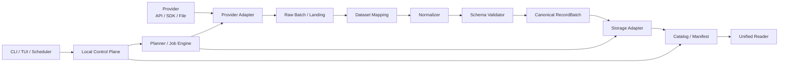
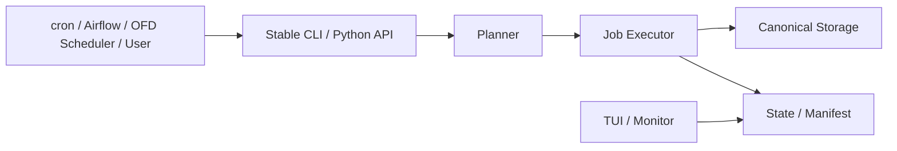
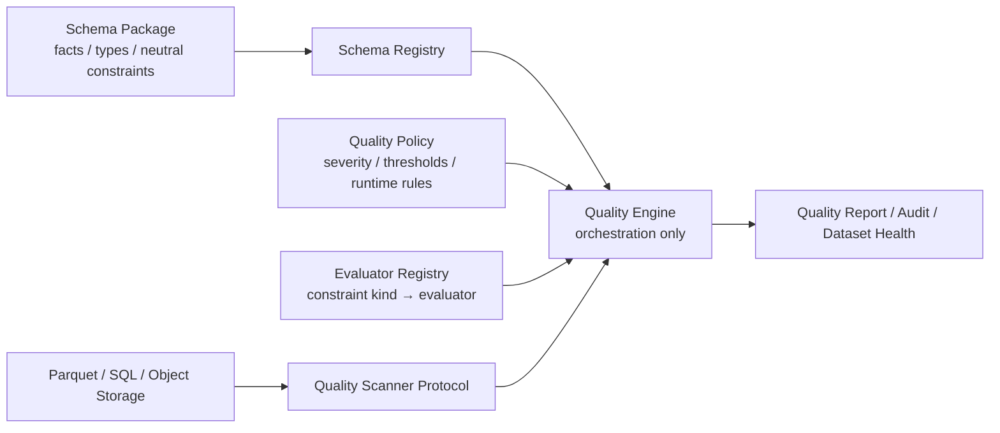

# OpenFinancialData 设计文档

> 状态：Draft  
> 版本：0.1  
> 项目简称：OFD  
> 目标读者：项目维护者、Provider 插件作者、Schema 作者、存储插件作者和高级用户

## 1. 项目概述

OpenFinancialData（OFD）是一个 Schema 优先、数据供应商无关、本地优先、开箱即用的金融数据中台。

它连接 AKShare、TuShare、REST API、Python SDK、本地文件等上游来源，将供应商特有的数据响应映射为稳定、可验证、可追溯的标准金融数据集，并负责这些数据集在本地的初始化、增量更新、状态管理、质量检查、资源治理和定时维护。

OFD 的核心承诺是：

1. 同一种金融数据产品切换供应商时，标准 Schema 和读取方式保持不变；
2. 同一标准数据集切换存储格式或物理布局时，查询语义保持不变；
3. 新增市场、资产类别或供应商时，不需要修改核心执行管道；
4. 从空白目录可以通过一个命令建立可持续更新的本地金融数据环境；
5. 任意正式发布的数据都可以追溯到来源、请求、Schema、映射版本和运行批次。

项目定位：

> Any provider. One financial data standard.

### 1.1 实现语言

OFD 以 Python 作为核心及首选实现语言。核心引擎、Provider Adapter、Schema 生成、任务调度、CLI、TUI 和 Python SDK 均使用 Python 实现。

选择 Python 的主要原因：

- AKShare、TuShare、Pandas、Polars、PyArrow 和 DuckDB 等金融数据生态集中在 Python；
- Provider 插件可以直接复用现有 Python SDK 和 DataFrame 响应；
- Pydantic、Typer、Rich、Textual 等库能够覆盖配置、CLI、进度和 TUI；
- 研究人员可以直接在 Notebook、脚本和策略框架中使用同一套 SDK；
- 对 I/O 密集型采集任务，Python 的异步 I/O 和多进程执行已经足够。

首期不引入 Rust、Java 或 Go 核心服务。未来如有明确的性能瓶颈，可以通过 Arrow C Data Interface、Python 扩展模块或独立插件优化局部组件，但不得改变 Python 公共 API 和标准 Dataset 契约。

版本标准：

```text
唯一支持版本    Python 3.13
主要开发版本    Python 3.13
CI 覆盖         Python 3.13
```

OFD 不承诺兼容 Python 3.12 及更早版本。依赖选择、类型标注、测试和发布均以 Python 3.13 为标准；未来是否支持新的 Python 次版本需要单独验证和决策。

## 2. 目标与非目标

### 2.1 目标

- 为行情、财务、公司行动、行业、指数成分和参考数据定义版本化标准 Schema；
- 通过 Adapter 配置接入 AKShare、TuShare、通用 REST API、SDK 和文件来源；
- 统一字段名、类型、枚举、单位、时区和资产标识；
- 支持全量初始化、智能增量更新、区间回填、失败重试和缺口修复；
- 支持 Parquet、CSV 等存储格式及按资产、日期或分区归档；
- 管理本地数据覆盖范围、Watermark、质量、任务历史和资源占用；
- 提供 CLI、TUI、进度事件和定时更新；
- 默认单机、零服务依赖，同时保留团队化和服务化扩展接口。

### 2.2 非目标

OFD 核心层不负责：

- 技术指标、因子和特征计算；
- 策略信号、组合构建和回测；
- 撮合和实盘交易；
- 根据多个字段推导新的金融指标；
- 自行计算前复权、后复权或连续期货；
- 静默修正供应商返回的可疑金融数据；
- 自动融合多个供应商之间相互冲突的记录。

允许的处理仅限于数据规范化，例如字段重命名、类型转换、日期解析、单位换算、枚举映射、资产标识解析和供应商明确提供的数据版本标注。所有改变数值表现的转换必须声明、可审计、可复现。

## 3. 核心概念

### 3.1 Asset

Asset 表示金融工具或可观察对象是什么，例如股票、期货合约、期权合约、指数或商品现货。平台级 `asset_id` 独立于供应商代码。

示例：

```text
平台 asset_id   CN.XSHG.600000
AKShare         600000
TuShare         600000.SH
券商 API        SHSE.600000
```

### 3.2 Dataset

Dataset 表示记录资产的哪一种数据，例如股票日线、期货日线、利润表或行业归属。Dataset 是 OFD 的主要逻辑数据产品。

### 3.3 Provider

Provider 表示数据从哪里来，例如 AKShare、TuShare、Polygon 或用户自己的 REST API。Provider 不决定标准 Schema 和最终存储布局。

### 3.4 Adapter

Adapter 描述如何连接 Provider、构造请求、解析响应，并将某个 Provider 数据接口映射到标准 Dataset。

### 3.5 Storage Profile

Storage Profile 描述标准数据的物理格式、路径、分区、排序、压缩和写入策略。它不改变 Dataset 的金融语义。

### 3.6 Catalog 与 Manifest

Catalog 保存当前可查询状态；Manifest 保存每次运行不可变的审计事实。

### 3.7 Watermark

Watermark 描述数据集或分区的时间进度：

- `observed_watermark`：本地实际观测到的最大业务日期；
- `expected_watermark`：根据交易日历和发布时间推算的应有日期；
- `committed_watermark`：已经完整校验并正式提交的日期。

## 4. 总体架构



系统分为六层：

1. 金融契约层：Asset Registry、Dataset Schema、类型系统；
2. 来源接入层：Provider Adapter、Mapping、Capability；
3. 执行层：Planner、Job、Retry、Recovery；
4. 数据治理层：Normalization、Validation、Storage、Catalog、Manifest；
5. 本地控制平面：State、Watermark、Schedule、Resource、Cleanup；
6. 产品交互层：Preset、CLI、TUI、Progress、Doctor。

## 5. Schema 系统

### 5.1 唯一事实来源

OFD 使用语言中立的声明式 Schema 作为唯一事实来源，并由它生成：

- Pydantic 单记录模型；
- PyArrow Schema；
- SQL DDL；
- 批量校验表达式；
- 数据字典和文档。

Pydantic 不是唯一 Schema，因为核心契约不能与 Python、数据库或某种存储格式绑定。

### 5.2 中立类型系统

首期支持：

```text
string, boolean, int32, int64, float32, float64,
decimal, date, datetime, enum, binary, json
```

示例映射：

| OFD 类型 | Python/Pydantic | Arrow | SQL |
|---|---|---|---|
| `string` | `str` | `string` | `VARCHAR` |
| `int64` | `int` | `int64` | `BIGINT` |
| `decimal(18,6)` | `Decimal` | `decimal128(18,6)` | `DECIMAL(18,6)` |
| `date` | `date` | `date32` | `DATE` |
| `datetime` | `datetime` | `timestamp` | `TIMESTAMP` |
| `enum` | `StrEnum` | `string/dictionary` | `VARCHAR/ENUM` |

### 5.3 Dataset Schema 示例

```yaml
name: market.equity.bar.daily
version: 1.0.0
status: stable
description: 股票日线行情

primary_key:
  - asset_id
  - trade_date
  - adjustment
  - provider

fields:
  trade_date:
    type: date
    nullable: false
    title: 交易日期

  asset_id:
    type: string
    nullable: false
    semantic_type: asset_id
    pattern: '^[A-Z]{2}\.[A-Z0-9]{4}\.[A-Z0-9.]+$'

  adjustment:
    type: enum
    values: [none, forward, backward]
    nullable: false
    default: none

  close:
    type: decimal
    precision: 18
    scale: 6
    nullable: false
    minimum: 0
    semantic_type: price
    unit: currency_per_share
    title: 收盘价
    aliases: [close_price, closing_price, 收盘, 收盘价]

  volume:
    type: int64
    nullable: true
    minimum: 0
    semantic_type: volume
    unit: share

row_constraints:
  - name: valid_ohlc_high
    expression: high >= open and high >= close and high >= low
  - name: valid_ohlc_low
    expression: low <= open and low <= close and low <= high

dataset_constraints:
  uniqueness:
    - [asset_id, trade_date, adjustment, provider]
  recommended_sort:
    - asset_id
    - trade_date
```

### 5.4 规则分层

- 字段规则：类型、空值、范围、格式、精度；
- 行级规则：OHLC 关系等单记录约束；
- 数据集规则：唯一性、排序、覆盖率和跨记录约束；
- 存储提示：推荐分区和排序，但可被 Storage Profile 覆盖。

验证器发现异常时默认拒绝或隔离记录，不得静默修正。

### 5.5 Schema 组合

优先使用字段模块组合，避免深层继承：

```yaml
name: market.future.bar.daily
includes:
  - common.record_identity
  - common.provider_lineage
  - market.bar.daily
  - market.ohlcv
  - derivative.settlement
  - derivative.open_interest
```

组合模块不能形成循环依赖，展开后的字段冲突必须显式解决。

### 5.6 版本规则

- 新增兼容的可选字段：minor；
- 修改字段类型、主键或金融语义：major；
- 文档或不改变兼容性的约束修正：patch。

Schema、Provider Mapping 和数据文件必须分别记录版本。

## 6. 资产与市场模型

### 6.1 资产主数据

所有资产共享最小公共主表：

```text
asset_id, asset_class, instrument_type, name, exchange,
currency, country, timezone, valid_from, valid_to, status
```

专属属性使用独立数据产品：

```text
reference.asset.master
reference.asset.identifier
reference.equity.definition
reference.future.contract
reference.option.contract
reference.index.definition
reference.exchange
reference.trading_calendar
reference.trading_session
```

### 6.2 标识符历史

Ticker 不是稳定主键。标识映射必须包含生效区间：

```text
asset_id, identifier_type, identifier_value, provider,
exchange, valid_from, valid_to
```

Identifier Resolver 负责将不同 Provider 的代码解析为平台 `asset_id`。Adapter 不得自行拼接资产标识。

### 6.3 跨市场

业务日期采用交易所本地日期；时间戳保存明确时区并规范为 UTC。美股等市场需要明确 regular、pre-market、after-hours 或 combined session。

### 6.4 期货

必须区分真实合约与供应商构造的连续合约：

```text
future_contract
future_continuous
```

连续合约应标记 `tradable=false`、构造 Provider 和 roll method。OFD 不自行生成连续合约。

### 6.5 期权

期权拆分为：

```text
reference.option.contract
market.option.quote
market.option.trade
market.option.bar.daily
market.option.chain.snapshot
```

期权链保持一行一个合约、一个观察时间，不使用无限宽表。

### 6.6 初始数据产品命名空间

```text
reference.asset.master
reference.asset.identifier
reference.calendar.trading
reference.equity.industry_membership
reference.index.constituent

market.equity.bar.daily
market.equity.bar.minute
market.index.bar.daily
market.etf.bar.daily
market.future.bar.daily
market.option.bar.daily
market.option.chain.snapshot

corporate_action.equity.dividend
corporate_action.equity.split
corporate_action.equity.adjustment_factor

fundamental.equity.balance_sheet
fundamental.equity.income_statement
fundamental.equity.cash_flow
```

## 7. Provider Adapter

### 7.1 设计原则

Adapter 只负责：

1. 连接供应商；
2. 构造和执行请求；
3. 将响应解析为 RawBatch；
4. 将来源字段映射到标准 Dataset。

Adapter 不决定 Schema、最终存储、多源冲突策略或统一读取方式。

### 7.2 两层结构

- Provider Adapter：认证、连接、限速、重试、SDK/HTTP 执行；
- Dataset Mapping：某个 Provider 接口到标准 Dataset 的字段和转换规则。

### 7.3 Provider 协议

```python
class ProviderAdapter(Protocol):
    provider_id: str

    def describe(self) -> ProviderDescriptor: ...
    def capabilities(self) -> Sequence[Capability]: ...

    async def fetch(
        self,
        request: ProviderRequest,
        context: FetchContext,
    ) -> AsyncIterator[RawBatch]: ...
```

### 7.4 声明式配置与代码扩展

简单来源使用通用执行器加 YAML：

- REST GET/POST；
- query/header/body 参数；
- JSON/CSV/DataFrame 响应；
- page/offset/cursor 分页；
- 超时、限速和重试；
- 字段映射和白名单转换。

复杂来源使用插件实现：

- 签名算法；
- 动态认证；
- 两阶段异步任务；
- WebSocket；
- 特殊压缩或非标准分页。

配置不得嵌入任意 Python、`eval` 或不受控模板代码。

### 7.5 Mapping 示例

```yaml
id: tushare.equity_daily
provider: tushare
canonical_schema: market.equity.bar.daily@1.0.0

source:
  executor: python_method
  object_factory: tushare.pro_api
  method: daily

request:
  parameters:
    ts_code: {from: request.provider_symbol}
    start_date: {from: request.start_date, format: "%Y%m%d"}
    end_date: {from: request.end_date, format: "%Y%m%d"}

response:
  format: dataframe

mapping:
  trade_date: trade_date
  ts_code: provider_symbol
  open: open
  high: high
  low: low
  close: close
  vol: volume
  amount: turnover

normalizers:
  trade_date:
    - {op: parse_date, format: "%Y%m%d"}
  volume:
    - {op: multiply, value: 100}
    - {op: cast, type: int64}
  turnover:
    - {op: multiply, value: 1000}

constants:
  provider: tushare
  currency: CNY
  frequency: 1d
```

### 7.6 转换白名单

首期支持：

```text
cast, rename, parse_date, parse_datetime, multiply, divide,
map_enum, replace_null, trim, uppercase, timezone_convert,
resolve_asset_id
```

每个转换必须声明输入输出类型、错误行为和是否影响数值单位。

### 7.7 Capability

```yaml
capability:
  dataset: market.equity.bar.daily
  markets: [CN]
  frequencies: [1d]
  adjustments: [none, forward, backward]
  supports:
    asset_filter: true
    date_range: true
    incremental: true
  limits:
    maximum_days_per_request: 5000
    maximum_assets_per_request: 1
```

Planner 根据 Capability 自动拆分资产、日期、分页和限速任务。

### 7.8 认证

凭证配置只允许引用环境变量或 Secret Provider：

```yaml
credentials:
  - name: token
    source: environment
    environment_variable: TUSHARE_TOKEN
```

凭证不得写入项目配置、Manifest、日志或异常文本。

### 7.9 统一错误模型

```text
AuthenticationError
RateLimitError
TemporaryProviderError
InvalidRequestError
DataNotFoundError
ProviderSchemaChangedError
```

核心执行器根据错误类型决定立即停止、退避重试、记录空数据或隔离批次。

### 7.10 数据源路由与绑定

Provider 不能只作为项目级全局配置。OFD 使用 Source Routing Policy，根据 Dataset 及其维度选择具体 Adapter。

例如：

```yaml
sources:
  routes:
    - id: cn-equity-daily
      match:
        dataset: market.equity.bar
        market: CN
        frequency: 1d
        adjustment: none
      use:
        adapter: akshare.equity_daily

    - id: cn-equity-weekly
      match:
        dataset: market.equity.bar
        market: CN
        frequency: 1w
        adjustment: none
      use:
        adapter: tushare.equity_weekly

    - id: us-equity-daily
      match:
        dataset: market.equity.bar
        market: US
        frequency: 1d
      use:
        adapter: polygon.equity_daily
```

路由匹配维度首期包括：

```text
dataset
market
asset_class
instrument_type
frequency
adjustment
session
provider_dataset_variant
```

后续可以增加 exchange、asset selector 和日期生效区间，但不允许在首期加入任意表达式语言。

Planner 接到逻辑请求后执行：

```text
Dataset Request
    → Source Router
    → Capability Check
    → Adapter + Mapping Version
    → Provider Request Plan
```

路由规则必须满足：

- 匹配结果确定且可解释；
- 更具体规则优先于通用规则；
- 同等优先级匹配多个规则时配置校验失败；
- Adapter Capability 必须覆盖所请求的市场、频率和复权状态；
- `ofd config explain-source` 能显示某个请求最终选择了哪个 Adapter 以及原因；
- 每个运行 Manifest 固化解析后的 Adapter、Provider、upstream endpoint 和 Mapping 版本。

示例：

```bash
ofd config explain-source \
  --dataset market.equity.bar \
  --market CN \
  --frequency 1w
```

输出：

```text
Matched route: cn-equity-weekly
Adapter:       tushare.equity_weekly
Provider:      tushare
Schema:        market.equity.bar@1.0.0
Mapping:       tushare-equity-weekly@1.1.0
```

### 7.11 Primary、Fallback 与故障切换

路由可以声明候选顺序，但默认不自动跨 Provider 切换：

```yaml
use:
  primary: akshare.equity_daily
  fallback:
    - tushare.equity_daily
  fallback_policy: explicit
```

支持策略：

```text
disabled   不允许 fallback
explicit   主来源失败后提示或要求显式参数
automatic  满足严格条件时自动切换，并记录告警与 lineage
```

首版默认 `explicit`。自动切换必须满足：

- 两个 Adapter 输出相同 Dataset Schema；
- 单位、时区、复权、session 和业务日期语义兼容；
- 切换边界按完整分区执行，不能在一个分区内无标记混合；
- Manifest 和 Catalog 记录实际 Provider；
- 切换后运行数据差异检查；
- 用户能够配置是否允许产生 mixed-provider Dataset。

Provider 恢复后不会自动覆盖 fallback 已提交的数据。重新统一来源必须通过显式 reingest/rebuild 操作完成。

### 7.12 Provider Assignment 与历史一致性

Catalog 在 Dataset 分区级记录：

```text
logical_dataset
route_id
provider
adapter_id
provider_endpoint
schema_version
mapping_version
valid_from
valid_to
run_id
```

当用户把日线来源从 AKShare 改为 TuShare 时，新配置只影响后续计划，不静默重写历史数据。系统应检测并提示：

```text
Existing partitions: provider=akshare
New route:           provider=tushare
Action required: keep mixed history, switch from date, or rebuild
```

允许的显式策略：

```text
keep-history       历史保持原 Provider，新分区使用新 Provider
switch-from-date   从指定业务日期切换，并固定边界
rebuild-range      用新 Provider 重建指定区间
rebuild-all        重建整个 Dataset
```

读取 API 默认返回统一 Canonical 字段，但可以请求 lineage 字段或按 Provider 过滤。`ofd status` 必须显示 mixed-provider 状态和每个 Provider 的覆盖区间。

### 7.13 频率语义

不同频率应当是明确的数据产品维度，而不是假定可以互相计算：

```text
market.equity.bar + frequency=1d
market.equity.bar + frequency=1w
market.equity.bar + frequency=1mo
```

如果 AKShare 提供日线而 TuShare 直接提供周线，可以分别路由。由于 OFD 不负责派生计算，不能在核心中自动将日线聚合成周线。未来如提供派生数据扩展，生成的周线必须标记为 `derived`，并记录输入 Dataset、聚合规则和版本，不能冒充 Provider 原始周线。

## 8. 数据区域与存储

### 8.1 数据区域

```text
data/
├── landing/       # 上游响应，尽量原样、不可变
├── canonical/     # 通过标准 Schema 验证的正式数据
├── quarantine/    # 无法发布的异常记录或批次
└── exports/       # 可再生成的用户视图
```

Landing 用于重放、排查映射变化和审计；Canonical 是平台正式数据；Exports 不是事实来源。

### 8.2 默认物理方案

个人用户默认：

```text
Canonical data    Parquet + Zstandard
Analytical catalog/query  DuckDB
Operational state         SQLite
Manifest                  JSON
```

不默认启动 PostgreSQL、Redis、Airflow、Kafka 或对象存储。

### 8.3 Storage Adapter

```python
class StorageAdapter(Protocol):
    def write(
        self,
        dataset: DatasetRef,
        batch: pa.RecordBatch,
        context: WriteContext,
    ) -> WriteResult: ...

    def scan(self, query: DataQuery) -> pa.Table: ...
    def inspect(self, dataset: DatasetRef) -> StorageStats: ...
```

### 8.4 Storage Profile

```yaml
storage:
  format: parquet
  layout: partitioned
  partition_by: [market, year, month]
  sort_by: [asset_id, trade_date]
  compression: zstd
  write_mode: merge
```

支持的布局：

- `by_asset`：适合单票更新和 CSV 导出；
- `by_date`：适合全市场截面；
- `partitioned`：适合正式 Parquet 数据集；
- 数据库表：作为后续插件。

默认不把“一票一个 CSV”作为平台唯一事实来源。它可以作为导出视图。

### 8.5 推荐分区

| 数据产品 | 推荐分区 |
|---|---|
| 股票日线 | `market/year/month` |
| 期货日线 | `exchange/root_symbol/year` |
| 期权日线 | `underlying/year/month` |
| 期权链 | `underlying/trade_date` |
| 财务报表 | `market/report_period` |
| 行业归属 | `taxonomy/year` |
| 指数成分 | `index_asset_id/year` |

### 8.6 事务写入

正式发布遵循：

```text
写临时文件 → 校验 → checksum → 原子移动 → 提交 Catalog → 更新 Watermark
```

只有文件发布和 Catalog 提交成功后任务才算完成。中断时正式数据和 committed watermark 不变。

## 9. 多供应商与复权

### 9.1 多供应商冲突

首版采用 `single_provider + 可切换 Provider`。不同来源的同主键记录不做静默融合。

未来支持：

```yaml
resolution:
  mode: keep_all
  provider_priority: [wind, tushare, akshare]
  conflict_policy: report
  tolerance:
    price_relative: 0.0001
```

内部记录保留 `provider`、`source_record_id`、`ingested_at` 和 `run_id`。

### 9.2 复权数据

拆分为：

```text
market.equity.bar.daily.raw
corporate_action.equity.adjustment_factor
market.equity.bar.daily.provider_adjusted
```

OFD 可以保存 Provider 提供的复权价或复权因子，但不自行计算。复权记录必须包含方向、基准、Provider 和版本，不能只暴露一个语义不明的 `close`。

## 10. 任务引擎

### 10.1 统一执行路径

```text
bootstrap  → Planner(empty catalog, date range)
update     → Planner(watermark, calendar)
backfill   → Planner(explicit range)
repair     → Planner(missing/failed partitions)

Plan → Fetch → Land → Map → Normalize → Validate → Write → Commit
```

所有入口共用同一个 Job Engine。

Job Engine 属于核心应用服务，但它不是通用调度系统。它只负责一次命令内部的计划、执行、幂等、重试和提交，不负责决定命令何时运行。

### 10.2 Job 与 Task

Job 表示用户级操作，Task 表示可重试的执行单元。Task 稳定标识由以下内容组成：

```text
dataset + provider + asset/date partition + schema_version + mapping_version
```

Task 状态：

```text
pending, running, succeeded, empty, retrying,
failed, quarantined, cancelled, interrupted
```

Job 状态：

```text
planning, running, succeeded, partially_succeeded,
failed, cancelled, interrupted
```

### 10.3 幂等与恢复

重复执行默认：

- 跳过已经成功且 checksum 一致的分区；
- 重试失败或 interrupted 的 Task；
- 按主键合并，避免重复记录；
- 不覆盖仍在运行的任务；
- 为新运行创建独立 Manifest。

### 10.4 进度事件

核心引擎发布事件而不依赖某个 UI：

```text
JobStarted, PlanCreated, TaskStarted, BatchFetched,
BatchValidated, BatchWritten, TaskRetried, TaskFailed,
JobCompleted, ResourceSampled
```

CLI、TUI、JSON 日志和未来 Web UI 订阅同一事件流。

## 11. Catalog、状态与质量

### 11.1 状态存储

```text
.ofd/
├── state.db       # SQLite 运行状态
├── catalog.duckdb # DuckDB 数据目录与分析视图
├── locks/
├── runtime/
└── tmp/
```

SQLite 保存小事务和控制状态；DuckDB 查询 Parquet 并计算覆盖率；Manifest 保存不可变审计记录。

### 11.2 核心状态实体

```text
projects
datasets
dataset_partitions
jobs
job_tasks
job_events
audit_events
schedules
quality_checks
resource_snapshots
storage_objects
```

必须在分区层记录 Watermark、行数、文件、checksum 和健康状态，不能只记录数据集最大日期。

### 11.3 数据集健康状态

```text
healthy      达到预期且质量通过
stale        落后于预期日期
incomplete   部分资产或分区缺失
degraded     可用，但存在失败或隔离记录
updating     正在更新
failed       最近关键更新失败
unknown      尚未扫描
```

### 11.4 Manifest

```json
{
  "run_id": "01J...",
  "provider": "akshare",
  "dataset": "market.equity.bar.daily",
  "schema_version": "1.0.0",
  "mapping_version": "akshare-1.2.0",
  "request": {"start": "2025-01-01", "end": "2026-07-10"},
  "rows_received": 125000,
  "rows_accepted": 124998,
  "rows_rejected": 2,
  "output_files": ["..."],
  "status": "partial"
}
```

### 11.5 质量报告

质量检查至少覆盖：

- Schema 和类型；
- 主键唯一；
- 时间排序；
- OHLC 基本关系；
- 非负数量字段；
- 交易日覆盖；
- 预期资产覆盖；
- Provider 字段漂移；
- 分区 checksum 和 Catalog 一致性。

## 12. 本地资源治理

### 12.1 资源指标

- 数据区、缓存、临时文件和 Manifest 的磁盘占用；
- 任务耗时、CPU 时间、内存峰值；
- 下载字节数、API 请求数、速率和重试数；
- 当前并发、临时空间和预计剩余空间。

界面必须区分精确值和估算值。

### 12.2 资源预算

```yaml
execution:
  concurrency: auto
  max_workers: 8
  max_memory: 4GB
  max_cpu_percent: 70

storage:
  max_disk_usage: 50GB
  minimum_free_space: 5GB

cache:
  max_size: 2GB
  retention: 7d

landing:
  retention: 30d
```

任务启动前估算下载量、Canonical 大小和临时空间峰值。空间不足时拒绝启动，而不是下载到一半失败。

### 12.3 清理

```bash
ofd clean --dry-run
ofd clean cache
ofd clean temp
ofd clean landing --older-than 30d
```

默认永不删除 Canonical 数据；Manifest 默认长期保留；运行中的任务文件不可清理。

## 13. CLI、TUI 与用户体验

### 13.1 命名约定

```text
项目名       OpenFinancialData
简称         OFD
GitHub       open-financial-data
Python 包    open_financial_data
CLI          ofd
配置文件     ofd.yaml
状态目录     .ofd/
环境变量     OFD_
```

### 13.2 核心命令

```text
ofd init          初始化项目
ofd bootstrap     首次建立数据
ofd update        智能增量更新
ofd backfill      指定区间补数据
ofd repair        查漏补缺
ofd status        查看数据状态
ofd validate      执行质量校验
ofd jobs          查看任务历史
ofd doctor        诊断本地环境
ofd clean         安全清理资源
ofd tui           交互式管理
ofd schedule      管理定时任务
```

### 13.3 从空目录启动

```bash
mkdir market-data && cd market-data

ofd bootstrap \
  --preset cn-equity-daily \
  --provider akshare \
  --start 2020-01-01 \
  --end 2026-07-10
```

系统自动创建配置、资产目录、计划、数据区、Catalog、状态库、Manifest 和质量报告。

### 13.4 Preset

```text
cn-equity-daily
us-equity-daily
cn-future-daily
us-option-daily
cn-equity-fundamental
```

Preset 封装 Schema、参考数据依赖、Provider 默认项和 Storage Profile，普通用户不需要从零编写配置。

### 13.5 Dry Run

```bash
ofd bootstrap --preset cn-equity-daily --start 2020-01-01 --dry-run
```

显示 Provider、资产数、日期范围、预计调用、行数、空间和时间，不执行写入。

### 13.6 TUI

TUI 推荐使用 Textual；CLI 推荐 Typer；进度显示推荐 Rich。它们共享应用服务和事件流。

首页展示：

```text
┌─ OpenFinancialData ────────────────────────────────┐
│ Project      ~/market-data                         │
│ Health       DEGRADED                              │
│ Disk         12.8 GB / 50 GB                       │
│ Active jobs  1                                     │
├─ Datasets ─────────────────────────────────────────┤
│ Dataset                 Coverage       State   Size │
│ CN Equity Daily         → 2026-07-10   ✓       684M │
│ CN Futures Daily        → 2026-07-09   !       122M │
├─ Current Job ───────────────────────────────────────┤
│ 4,125 / 5,412 assets   76%   ETA ~03:42             │
│ 18.2 req/s   625 MB RAM   31 retries   2 failed     │
└─────────────────────────────────────────────────────┘
```

### 13.7 Doctor 与外部 Provider 诊断

`ofd doctor` 不仅检查本地配置和文件，还必须对项目启用的外部 Provider/API 进行探活和诊断。

```bash
ofd doctor
ofd doctor --provider akshare
ofd doctor --provider tushare --deep
ofd doctor --all-providers --format json
```

诊断分为五层：

| 层级 | 检查内容 | 是否访问外部服务 |
|---|---|---:|
| L0 Local | 配置、目录、状态库、锁、磁盘和 Schema Registry | 否 |
| L1 Runtime | Python 包、版本、插件加载和可选依赖 | 否 |
| L2 Network | DNS、TCP、TLS、代理和基础 URL 可达性 | 是 |
| L3 Auth | 凭证是否存在及轻量认证请求 | 是 |
| L4 Contract | 最小数据请求、响应结构、字段映射和类型兼容 | 是 |

默认 `ofd doctor` 执行 L0–L3；`--deep` 执行 L4。深度诊断可能消耗 API 配额，运行前和结果中必须明确显示请求数量。

示例输出：

```text
OpenFinancialData Doctor

Local
  ✓ Configuration valid
  ✓ State database accessible
  ✓ 36.2 GB disk available

AKShare
  ✓ Package 1.18.40 loaded
  ✓ Eastmoney endpoint reachable, 184 ms
  ✓ Tencent endpoint reachable, 231 ms
  ! stock_zh_a_hist response is missing optional field: 成交额

TuShare
  ✓ TUSHARE_TOKEN configured
  ✗ Authentication rejected: token invalid or expired

Summary: DEGRADED
  9 passed, 1 warning, 1 failed
```

每个 Provider 插件应提供诊断描述：

```python
class ProviderDiagnostics(Protocol):
    def probes(self) -> Sequence[ProbeDefinition]: ...

    async def run_probe(
        self,
        probe: ProbeDefinition,
        context: DiagnosticContext,
    ) -> ProbeResult: ...
```

`ProbeDefinition` 至少声明：

```text
probe_id
level
description
timeout
requires_network
requires_credentials
estimated_requests
estimated_quota_cost
safe_to_retry
```

通用 REST Adapter 可由配置声明探活端点：

```yaml
diagnostics:
  connectivity:
    method: HEAD
    path: /health
    expected_status: [200, 204]
    timeout_seconds: 5

  authentication:
    method: GET
    path: /v1/account
    expected_status: [200]
    redact_response: true

  contract:
    dataset: market.equity.bar.daily
    request:
      symbol: 000001
      start_date: 2026-01-05
      end_date: 2026-01-05
    expected_fields: [date, open, high, low, close]
    maximum_rows: 10
```

对于没有健康端点的 Provider，L2 只验证其公开基础域名的 DNS、TLS 和连接，不把首页 HTTP 状态直接等同于数据接口健康。L4 使用固定、最小、可重复的数据请求，不执行全市场下载。

诊断结果统一分类：

```text
healthy          探活和契约检查通过
degraded         可使用，但延迟高、字段有兼容警告或部分上游失败
unreachable      DNS、TCP、TLS 或网络不可达
unauthorized     凭证缺失、无效或权限不足
rate_limited     Provider 限流或配额耗尽
contract_drift   响应字段或类型与 Mapping 不兼容
dependency_error SDK 未安装、版本不兼容或插件加载失败
unknown          未执行或结果不确定
```

安全与行为约束：

- 任何输出不得显示 token、Cookie、签名或完整认证响应；
- URL 中的敏感 query 参数必须脱敏；
- Doctor 默认只读，不修改 Canonical 数据和 Watermark；
- 诊断数据只写入临时区域，并在完成后清理；
- 探活设置独立短超时，不继承长时间批量下载超时；
- 429 应报告 `rate_limited`，不能误判为服务不可用；
- 401/403 应区分缺少凭证、凭证无效和权限不足；
- 字段漂移报告新增、缺失和类型变化，不在 Doctor 中自动更新 Mapping；
- 单个 Provider 诊断失败不能阻止其他 Provider 检查；
- JSON 输出具有稳定 Schema，供定时监控、CI 和 TUI 使用。

Doctor 结果可以写入状态库形成 Provider 健康历史，但应设置保留期，且不得包含完整业务响应。TUI 在数据集和 Provider 页面显示最近探活时间、延迟、状态、连续失败次数及下次重试时间。

## 14. 智能更新与可选调度

### 14.1 解耦原则

调度与 OFD 核心数据功能完全解耦。核心只提供可独立执行、幂等、可观察的 CLI 和 Python API：

```bash
ofd bootstrap
ofd update
ofd backfill
ofd repair
ofd validate
ofd doctor
ofd status
```

任何外部系统都可以调用这些命令：

```text
cron / launchd / systemd timer
Airflow / Prefect / Dagster
GitHub Actions / CI
Docker / Kubernetes CronJob
用户自己的 Python 或 Shell 程序
OFD 可选 Scheduler
```

核心不知道是谁触发了命令，也不依赖 Scheduler 进程、Scheduler 数据库或特定触发器。即使完全不安装调度扩展，bootstrap、update、repair、status 和 doctor 仍能完整工作。



调度层只提供便利功能：

- 根据市场收盘时间决定何时调用 CLI；
- 生成或安装 cron、launchd、systemd timer 配置；
- 观察最近运行、连续失败和下次触发时间；
- 机器离线后根据状态调用 `ofd update` 补跑；
- 可选发送通知。

它不得：

- 绕过 CLI/Python 应用服务直接写金融数据；
- 维护一套独立于核心的成功状态；
- 自行推进 Dataset Watermark；
- 把核心幂等性建立在某种 Scheduler 上；
- 要求用户保持常驻进程才能使用 OFD。

### 14.2 更新规划

用户只需执行：

```bash
ofd update
```

Planner 根据 Catalog Watermark、交易日历、当前时间、市场收盘、Provider 发布时间和 Capability 决定更新范围。

“需要更新哪些日期和分区”属于核心 Planner；“何时执行 update”属于外部调度。这条边界确保外部调度器无需理解金融数据缺口，只需按时调用：

```bash
ofd update --project /path/to/project
```

即使同一天重复调用，核心也会根据 Watermark 和分区状态生成空计划或只修复未完成任务。

### 14.3 稳定自动化契约

CLI 必须为外部调度提供稳定契约：

```bash
ofd update --project /data/ofd --format json --non-interactive
```

要求：

- 非交互模式不等待终端输入；
- JSON 输出具有版本化 Schema；
- 日志写入 stderr，机器结果写入 stdout；
- 支持明确的超时、锁等待和取消行为；
- 重复执行保持幂等；
- Secret 不出现在参数回显和日志中。

建议退出码：

| 退出码 | 含义 |
|---:|---|
| 0 | 成功，或无需更新 |
| 2 | 参数或配置错误 |
| 3 | 项目锁冲突 |
| 4 | Provider 认证或权限错误 |
| 5 | Provider 暂时不可用或限流 |
| 6 | 数据契约漂移或质量失败 |
| 7 | 部分成功，仍有失败分区 |
| 8 | 本地资源不足 |
| 130 | 用户取消或收到 SIGINT |

JSON 结果至少包含：

```json
{
  "output_version": "1.0",
  "run_id": "01J...",
  "command": "update",
  "status": "partial",
  "planned_tasks": 5412,
  "succeeded_tasks": 5409,
  "failed_tasks": 3,
  "committed_watermark": "2026-07-10"
}
```

### 14.4 可选调度后端

```python
class SchedulerBackend(Protocol):
    def install(self, schedule: ScheduleSpec) -> None: ...
    def remove(self, schedule_id: str) -> None: ...
    def status(self) -> Sequence[ScheduleStatus]: ...
```

首期支持：

- 输出 cron 配置示例；
- 生成 macOS launchd plist；
- 生成 Linux systemd timer；
- 后续可选内置常驻 Scheduler 和 Windows Task Scheduler。

首期优先“生成配置”，而不是在核心包中维护常驻 Scheduler。生成后的系统任务只调用稳定 CLI。

### 14.5 金融语义触发

```yaml
schedules:
  cn_market_daily:
    datasets: [market.equity.bar.daily]
    trigger:
      type: market_close
      market: CN
      delay: 2h
    timezone: Asia/Shanghai
    catch_up: true
    catch_up_limit: 30d
```

`market_close + delay` 优先于普通 cron，以正确处理节假日、临时休市和数据延迟。

该配置属于可选调度扩展。使用普通 cron 的用户不需要理解它，因为 `ofd update` 自己会检查交易日历和 expected watermark，在休市日安全返回“无需更新”。

### 14.6 补跑

机器关机或任务错过后，启动时执行 reconciliation。小于 `catch_up_limit` 的缺口自动生成补跑任务；更大范围要求用户显式执行 `backfill`。

Reconciliation 本质上仍是调用核心 `update` 或 `backfill`，而不是由调度层直接创建数据分区。对于未安装 OFD Scheduler 的用户，下一次普通 `ofd update` 同样能够依据 Watermark 补齐缺口。

## 15. 插件系统

插件类型：

```text
ProviderPlugin
SchemaPackage
StoragePlugin
ValidatorPlugin
SchedulerPlugin
```

包命名：

```text
ofd-provider-akshare
ofd-provider-tushare
ofd-provider-rest
ofd-storage-parquet
ofd-storage-postgres
ofd-schemas-market
ofd-schemas-fundamental
```

核心包不得 import AKShare、TuShare 或具体数据库实现。插件通过 Python entry points 注册，启动时进行版本兼容和配置校验。

### 15.1 Agent Skill

仓库提供项目级 `open-financial-data` Agent Skill，使 Claude Code、Codex 等支持 Skill 的开发工具能够通过自然语言操作或开发 OFD。

```text
skills/open-financial-data/
├── SKILL.md
├── agents/openai.yaml
└── references/operations.md
```

Claude Code 通过 `.claude/skills/open-financial-data` 引用同一技能，避免维护重复副本。

Skill 负责：

- 将“更新到最新”“检查 AKShare”“补去年三月数据”等自然语言映射到 OFD 操作；
- 先检查真实 CLI 和实现阶段，不把设计命令伪装为已实现功能；
- 对大范围写操作优先 dry run，并检查项目锁、磁盘和 Provider 状态；
- 解释 Watermark、任务、质量、Manifest 和资源状态；
- 通过稳定 CLI/Python API 操作，不直接篡改 Catalog；
- 在实现新功能时遵守 Schema、Adapter、Storage 和控制平面的架构边界。

Skill 是交互指导层，不复制业务实现。所有实际数据操作仍由 OFD CLI/Python API 完成，因此 Skill 的存在不影响无人值守自动化，也不成为核心运行依赖。

## 16. 项目配置

最小用户配置：

```yaml
project:
  name: my-market-data

preset: cn-equity-daily

sources:
  routes:
    - match:
        dataset: market.equity.bar
        market: CN
        frequency: 1d
      use:
        adapter: akshare.equity_daily

history:
  start: 2020-01-01

storage:
  format: parquet
  root: ./data

update:
  schedule:
    type: market_close
    delay: 2h
  catch_up: true

quality:
  profiles:
    - id: equity-daily-standard
      dataset: market.equity.bar
      include_schema_constraints: true
      rules:
        - {id: catalog_row_count, severity: error}
        - {id: partition_consistency, severity: error}
        - {id: watermark_consistency, severity: error}
```

Schema 自身定义字段类型、空值、主键和 OHLC 等数据规范事实，但不知道质量引擎、执行 handler、严重级别、存储格式或报告方式。Constraint 只包含中立的 `id`、`kind`、`scope` 和参数。

Quality Profile 不重复数据规范，只通过 `include_schema_constraints` 决定是否纳入检查计划，并定义严重级别、阈值及 Catalog、分区、覆盖率和 Watermark 等运行规则。Evaluator Registry 将中立 constraint kind 映射为执行器；Quality Scanner 通过协议读取 Parquet 或未来的数据库/对象存储；Quality Engine 只负责解析、编排和汇总。

质量规则支持 `enabled`、`severity` 和 `params.max_violations`。`ofd validate` 先从 Schema Registry 解析 Dataset Schema，再将 Constraint Definitions 编译为检查计划，最后叠加 Quality Profile 中的运行规则。版本化报告写入 `.ofd/quality/`，同时更新 SQLite `quality_checks` 和 Dataset 健康状态。规则失败不会自动修正或删除数据。



解耦约束：

- Schema 不 import Quality Engine、Scanner、Catalog 或 Provider；
- Quality Policy 不包含 Python 函数和存储读取逻辑；
- Evaluator 不负责定位文件或写报告；
- Scanner 不决定规则严重级别和通过阈值；
- Engine 依赖 `SchemaRegistry`、`QualityScanner` 和 `QualityEvaluatorRegistry` 协议，而非具体实现；
- Provider、Storage 和 Scheduler 不参与质量规则定义；
- 新增存储格式只实现 Scanner，新约束只注册 Evaluator，新数据产品只注册 Schema。

高级用户通过覆盖配置调整分区、压缩、并发、重试和资源预算。以下命令显示完全展开后的配置：

```bash
ofd config show --resolved
```

配置合并只支持字典深度合并、显式覆盖、环境变量插值和文件引用，不支持循环或任意代码。

## 17. Python 读取接口

```python
from open_financial_data import Project

project = Project.open("./market-data")

data = project.read(
    "market.equity.bar.daily",
    assets=["CN.XSHG.600000"],
    start="2025-01-01",
    end="2025-12-31",
    provider="akshare",
    adjustment="none",
)
```

默认返回 PyArrow Table，并提供 Pandas、Polars 和 DuckDB 适配方法。大批量校验使用 Arrow 和向量化表达式，避免逐行构造 Pydantic 对象。

## 18. 安全、可靠性与可观察性

- Secret 永不写入日志和 Manifest；
- 所有正式文件带 checksum；
- Landing 和 Manifest 默认不可变；
- Catalog 更新必须与文件发布保持事务一致；
- 同一项目使用进程锁防止冲突写入；
- 日志支持 human、JSON 两种格式；
- 每个错误包含 job、task、provider、dataset 和 retryability 上下文；
- Provider 字段漂移必须立即隔离，不允许静默丢列；
- 用户可取消任务，取消过程完成当前原子写入后安全退出。
- Provider 探活结果记录延迟、状态、错误类别和契约漂移摘要；
- 可选调度轻量 L2/L3 Probe，连续失败达到阈值后将 Provider 标记为 degraded；
- 定时探活默认不运行消耗配额的 L4 Contract Probe。

### 18.1 Python 执行模型

- 网络采集使用 `asyncio`，并通过 Provider 级 Semaphore 执行限速；
- 同步 SDK 通过受控线程池调用，避免阻塞事件循环；
- Arrow、DuckDB、Polars 等原生向量化操作承担批量处理；
- CPU 密集型校验在确有需要时使用多进程，而不是逐行 Python 循环；
- 数据批次在核心管道中优先使用 `pyarrow.RecordBatch` 或 `pyarrow.Table`；
- Pydantic 用于配置、请求、Manifest 和少量记录边界，不用于逐行校验百万级行情；
- 所有插件使用类型标注，并通过 Protocol 而非具体基类与核心耦合。

建议核心依赖：

```text
pydantic          配置、契约和模型生成
pyarrow           标准批量交换和 Parquet
duckdb            本地查询与分析 Catalog
sqlite3           运行状态，优先使用标准库
typer             CLI
rich              进度与终端输出
textual           TUI
httpx             通用 HTTP Adapter
PyYAML/ruamel     声明式配置
platformdirs      跨平台状态目录
```

Pandas、Polars、AKShare 和 TuShare 应作为可选依赖或 Provider extra，避免核心安装被单一供应商依赖锁定。

### 18.2 统一可观测性模型

OFD 的所有重要行为必须可追踪，但不把“可追踪”错误实现为记录每一行金融数据。系统分为四类信号：

| 信号 | 用途 | 默认存储 |
|---|---|---|
| Operational Log | 人类和程序诊断运行过程 | 轮转 JSONL/终端 |
| Audit Event | 记录谁在何时请求了什么及状态如何改变 | SQLite + Manifest |
| Metric | 观察速率、延迟、资源和质量趋势 | SQLite 降采样，可导出 |
| Trace | 串联一次命令、Job、Task、请求和写入 | 结构化上下文，可选 OpenTelemetry |

统一关联标识：

```text
correlation_id   一次外部调用或自然语言操作
run_id           一次 OFD 命令运行
job_id           一次逻辑 Job
task_id          一个可重试 Task
request_id       一次 Provider 请求
batch_id         一个 Raw/Canonical Batch
write_id         一次原子发布
```

所有日志、审计事件、指标和 Manifest 使用这些 ID 关联。跨进程调用时通过环境变量或 CLI 参数传递 `correlation_id`，未提供时由核心生成。

### 18.3 结构化日志

默认同时支持：

```text
交互终端      Rich 人类可读输出
文件日志      JSON Lines
自动化 stdout 稳定命令结果 JSON
自动化 stderr 结构化或文本日志
```

日志事件最小字段：

```json
{
  "timestamp": "2026-07-11T10:30:12.481Z",
  "level": "INFO",
  "event": "provider.request.completed",
  "message": "Provider request completed",
  "correlation_id": "01J...",
  "run_id": "01J...",
  "job_id": "01J...",
  "task_id": "01J...",
  "provider": "akshare",
  "adapter": "akshare.equity_daily",
  "dataset": "market.equity.bar",
  "duration_ms": 184,
  "row_count": 243,
  "status": "success"
}
```

事件名使用稳定的点分命名空间：

```text
command.started / command.completed
config.loaded / config.route_resolved
job.planned / job.started / job.completed
task.started / task.retrying / task.failed / task.completed
provider.request.started / provider.request.completed / provider.request.failed
batch.landed / batch.normalized / batch.validated / batch.quarantined
storage.write.started / storage.write.committed / storage.write.rolled_back
catalog.updated / watermark.advanced
doctor.probe.completed
schedule.triggered
resource.threshold_exceeded
```

禁止依赖自由文本 `message` 进行程序判断；自动化应使用 `event`、`status`、错误分类和结构化字段。

### 18.4 审计事件

审计记录回答：

```text
谁或什么触发了操作？
使用了哪个配置和路由？
请求处理了哪个 Dataset、Provider 和日期范围？
哪些状态或正式文件发生了改变？
Watermark 为什么前进或没有前进？
```

必须审计：

- CLI、Python API、Agent Skill、Scheduler 或外部系统触发来源；
- 命令参数的安全副本和 resolved configuration hash；
- Source Route、Provider、Adapter、Schema 和 Mapping 版本；
- Job/Task 状态转换及原因；
- fallback、Provider 切换和 mixed-provider 决策；
- 数据校验、拒绝、隔离和人工 override；
- Canonical 发布、替换、重建和清理；
- Catalog 与 Watermark 变化；
- 配置变更、Schedule 变更和 Doctor 结果；
- 用户取消、进程中断和恢复。

审计事件默认只追加，不允许普通 `clean` 修改。Manifest 是一次运行的不可变汇总，Audit Event 是运行中的细粒度状态历史。

### 18.5 指标

首期指标：

```text
ofd_provider_requests_total
ofd_provider_request_duration_ms
ofd_provider_errors_total
ofd_provider_rate_limits_total
ofd_rows_received_total
ofd_rows_written_total
ofd_rows_rejected_total
ofd_tasks_total{status=...}
ofd_data_watermark_lag_days
ofd_partition_completeness_ratio
ofd_storage_bytes
ofd_process_memory_bytes
ofd_job_duration_seconds
```

默认将任务级汇总和降采样资源数据写入 SQLite。后续通过可选 exporter 输出 Prometheus/OpenTelemetry，不让监控后端成为核心依赖。

### 18.6 Trace

一次更新可以串联为：

```text
command:update
  └── job:cn-equity-daily
      ├── task:asset-bucket-001
      │   ├── provider.request
      │   ├── normalize
      │   ├── validate
      │   └── storage.commit
      └── catalog.commit
```

首期通过关联 ID 和结构化事件实现逻辑 Trace，不要求部署 Trace Server。后续可以用 OpenTelemetry SDK 导出 span。

### 18.7 日志级别与采样

```text
ERROR  操作失败、数据未提交或一致性风险
WARN   可恢复异常、重试、fallback、隔离或质量警告
INFO   命令、Job、Task 和提交等生命周期事件
DEBUG  请求规划、字段映射摘要和诊断上下文
TRACE  高频内部细节，默认关闭
```

全市场任务不能默认为每一行记录日志。推荐：

- Job、Task、Provider 请求和分区提交逐事件记录；
- 行级异常按类型聚合，同时在 Quarantine 中保存受控样本；
- 重复错误使用计数和采样，保留首个、最后一个及代表样本；
- 高频资源指标降采样；
- DEBUG/TRACE 设置独立保留期。

### 18.8 脱敏与数据最小化

严禁写入日志或审计：

- API token、Cookie、Authorization Header 和签名；
- 含 Secret 的完整 URL 或请求体；
- 完整 Provider 响应；
- 无必要的个人信息；
- 环境变量完整内容。

允许记录经过脱敏或摘要化的信息：

```text
credential_source = env:TUSHARE_TOKEN
credential_present = true
request_params_hash = sha256:...
response_schema_hash = sha256:...
config_hash = sha256:...
```

脱敏在日志事件进入 handler 之前执行，不能依赖输出端临时替换。异常对象和第三方 SDK 日志也必须经过统一过滤器。

### 18.9 保留、轮转与查询

默认建议：

```yaml
observability:
  logs:
    format: jsonl
    directory: .ofd/logs
    rotate_size: 50MB
    retention: 30d
  audit:
    retention: permanent
  metrics:
    raw_retention: 7d
    hourly_retention: 180d
  debug:
    retention: 3d
```

查询接口：

```bash
ofd logs tail
ofd logs show --run <run-id>
ofd audit show --run <run-id>
ofd audit search --event watermark.advanced
ofd metrics show --provider akshare --since 24h
ofd jobs show <job-id> --events
```

日志丢失不应影响数据正确性；审计或 Manifest 无法提交时，涉及 Canonical 状态变化的操作不得报告为完整成功。

### 18.10 Agent 与自然语言操作

Agent Skill 调用 CLI 时应创建或传递 `correlation_id`，并在最终答复中返回 `run_id`。自然语言原文默认不完整写入审计，只记录：

```text
trigger_type = agent
agent_name
intent = update/status/doctor/...
prompt_hash
correlation_id
```

只有用户显式启用 prompt logging 时才保存原文，避免将潜在敏感信息永久写入状态库。

## 19. 建议代码结构

```text
src/open_financial_data/
├── schemas/
│   ├── model.py
│   ├── registry.py
│   └── generators/
├── assets/
├── providers/
│   ├── protocol.py
│   ├── registry.py
│   └── executors/
├── mappings/
├── normalization/
├── validation/
├── storage/
│   ├── protocol.py
│   ├── parquet.py
│   └── csv.py
├── catalog/
├── jobs/
│   ├── planner.py
│   ├── executor.py
│   ├── events.py
│   └── recovery.py
├── control/
│   ├── state.py
│   ├── resources.py
│   ├── health.py
│   └── cleanup.py
├── scheduling/
├── presets/
├── client.py
├── cli.py
└── tui.py
```

## 20. MVP 路线

### 当前实现快照（2026-07-11）

已完成中立 Schema→Pydantic/Arrow/SQL 编译、跨市场股票日/周/月与 AKShare 指数/期货/期权/复权/财务/行业/指数成分在线链路、AKShare/TuShare/REST/File Adapter、Adapter/Mapping/Schema/Storage entry point、Landing、Quarantine、原子分区/整库发布、SQLite Catalog/Job/Task/Metric、Manifest/Watermark、任务/Landing/Catalog 三种恢复路径、Primary/Fallback、Provider 差异报告、通用质量引擎、Python 查询、Rich Progress/TUI、Doctor、日志/审计/指标查询、资源清理以及 cron/launchd/systemd 定义生成。

可通过配置化 REST Adapter 接入美股在线源，通过 canonical JSONL 或插件扩展其他数据产品。本地个人版的设计目标已经形成闭环；对象存储/PostgreSQL 的具体实现、常驻服务和 Web UI 属于团队部署扩展，不是本地核心运行依赖。下列 Phase 列表保留为范围定义。

### Phase 0：契约原型

- 中立类型系统；
- Dataset Schema 解析与版本；
- Pydantic 和 Arrow 生成器；
- Mapping 配置模型；
- 核心 Protocol 和错误模型。

### Phase 1：A 股日线垂直切片

- `market.equity.bar.daily@1.0.0`；
- `reference.asset.master` 和 identifier mapping；
- AKShare Provider；
- CSV/File Provider；
- Parquet 分区存储；
- SQLite Catalog；
- SQLite Job 状态；
- bootstrap、update、status、validate；
- Rich 进度和 Manifest。
- 结构化 JSONL 日志、关联 ID 和基础审计事件。

### Phase 2：可运维产品

- TUI；
- retry、repair、backfill；
- doctor、Provider 分层探活和 clean；
- Watermark 与交易日历；
- launchd/systemd 定时更新；
- 资源预算和磁盘预检。

### Phase 3：扩展性验证

- TuShare Adapter；
- 美股日线 Provider；
- 中国期货日线；
- Provider 插件 entry points；
- Schema Package 和 Storage Plugin。

### Phase 4：高级资产与团队部署

- 期权合约和期权链；
- 财务三表和公司行动；
- 对象存储、PostgreSQL 等插件；
- 多 Provider 差异报告；
- 可选服务模式和 Web UI。

## 21. MVP 验收标准

1. 同一查询使用 AKShare 和 CSV Provider 时返回相同列、类型和语义；
2. 从空目录用一个命令建立指定日期范围的 A 股日线数据环境；
3. 重复执行 bootstrap/update 不产生重复记录；
4. 下载中断后再次运行只恢复未完成 Task；
5. 每条正式数据可追溯到 Provider、请求和运行批次；
6. Schema、Mapping 和存储布局均独立版本化；
7. 更改 by-asset/by-date/partitioned 布局不改变读取 API；
8. `ofd status` 正确显示覆盖率、Watermark、失败和磁盘占用；
9. 空间不足、认证失败和 Provider 字段变化能提前或明确失败；
10. 手动更新、TUI 更新和定时任务复用同一 Job Engine。
11. `ofd doctor` 能区分网络不可达、认证失败、限流、依赖缺失和响应契约漂移；
12. Doctor 深度探测不会写入正式数据，也不会泄露凭证。

## 22. 当前仓库迁移建议

当前仓库已经具备统一字段、跨资产目录、Manifest、Universe 和读取客户端的雏形。迁移时不应直接推倒现有采集脚本，而应按以下顺序抽取：

1. 将 `NORMALIZED_COLUMNS` 演进为声明式 Dataset Schema；
2. 将 AKShare 调用从 CLI 脚本提取为 Provider Adapter；
3. 将字段处理提取为 AKShare Dataset Mapping；
4. 将文件路径和 CSV 写入提取为 Storage Adapter；
5. 将现有 Manifest 纳入统一 Job/Task 状态模型；
6. 用新的 Unified Reader 兼容读取现有数据；
7. 经验证后，再迁移到默认 Parquet 分区布局。

迁移期间现有数据属于外部事实，不做破坏性重写。新旧路径通过 Catalog 注册和兼容 Reader 共存。

## 23. 已确定的关键决策

| 决策 | 选择 |
|---|---|
| 项目名称 | OpenFinancialData（OFD） |
| 核心实现语言 | Python |
| 唯一支持版本 | Python 3.13 |
| 核心定位 | Schema-first、provider-agnostic、local-first |
| 默认交换格式 | Apache Arrow |
| 默认正式存储 | Parquet + Zstandard |
| 默认分析接口 | Arrow/Pandas/Polars，可选 DuckDB SQL |
| 默认目录与运行状态 | SQLite |
| 默认运行状态 | SQLite |
| 单记录契约 | Pydantic，由声明式 Schema 生成 |
| 批量校验 | Arrow/向量化验证 |
| 默认供应商策略 | single-provider，可切换，不自动融合 |
| 数据源选择 | 按 Dataset/市场/频率等维度路由，不使用单一全局 Provider |
| 故障切换 | 默认 explicit；实际 Provider 固化到分区与 Manifest |
| 默认部署 | 单机零服务依赖 |
| 默认物理布局 | 按 Dataset/市场/年月分区 |
| 复权 | 保存 Provider 结果，不由核心计算 |
| 调度 | 与核心完全解耦；稳定 CLI 契约 + 可选调度扩展 |
| 交互 | CLI + TUI，共享 Job Engine 和事件流 |
| 可观测性 | 结构化日志 + 只追加审计 + 指标 + 关联 ID，OTel 可选 |

## 24. 已收敛的实现选择与扩展边界

早期设计中的开放问题已按本地核心闭环收敛：

- Schema 以 Python 中立模型作为唯一事实来源，可编译为 Pydantic、Arrow 和 SQL；外部 Schema 通过 entry point 注册，不绑定 YAML 或 JSON Schema；
- 金额与价格由各 Dataset Schema 显式声明类型和精度，不设置跨市场隐式精度；
- SQLite Catalog 保存分区级行数、日期范围、校验和和 Provider 归属，文件内容统计按需从 Parquet 扫描；
- 在线链路默认保留不可变 Landing 批次，失败映射进入脱敏 Quarantine；保留和清理由资源策略控制；
- Adapter、Mapping、Schema 和 Storage 使用独立 entry point 组，运行时通过 capability 与配置检查验证兼容性；
- 预期水位优先使用项目交易日历，未配置时使用明确标注的工作日回退；临时休市可由本地日历覆盖；
- Schema constraint 使用有限、具名的中立规则类型，由 Quality Evaluator Registry 解释，不执行任意表达式；
- 旧数据通过 `legacy-csv` 迁移，标准数据通过 `canonical-jsonl` 导入；零拷贝外部目录注册不属于本地核心的安全写入契约。

对象存储、PostgreSQL、常驻服务和 Web UI 保留为可选团队部署插件，不是当前单机开箱即用版本的完成条件。
